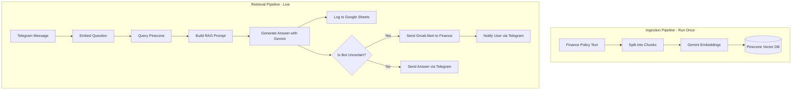
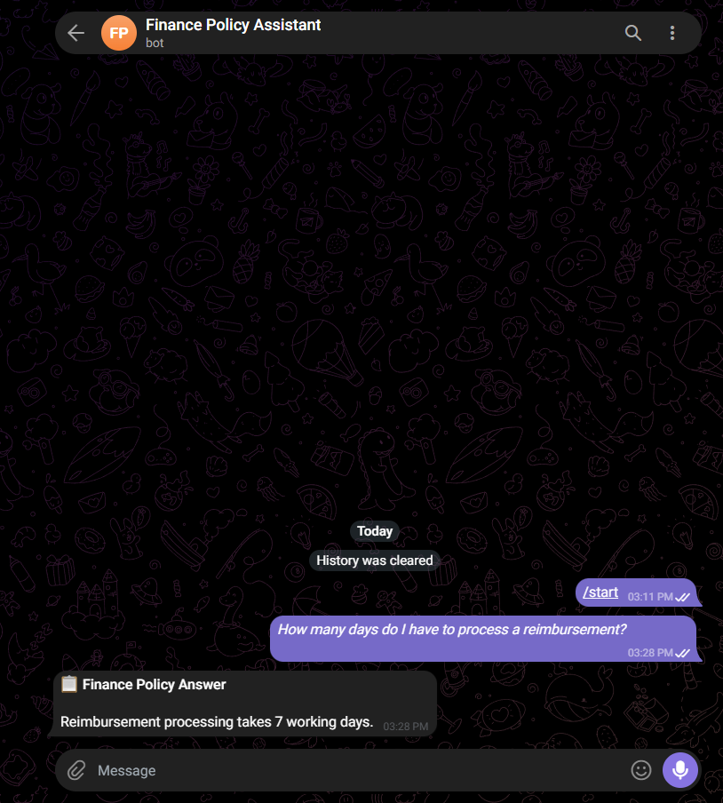
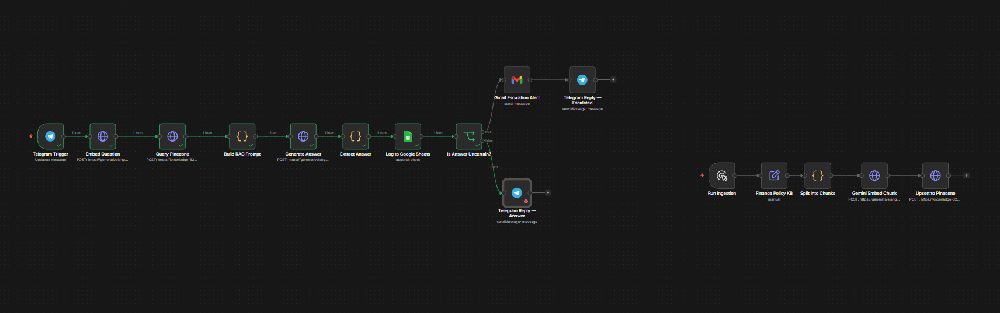
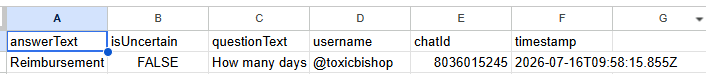
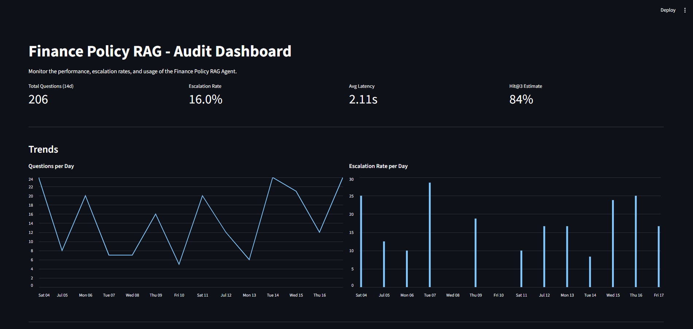

# Finance Policy RAG Agent

**[🔗 Live API](https://finance-rag-api.onrender.com/docs)** | **[📊 Dashboard](https://toxicbishop-finance-rag-dashboard.streamlit.app)**

Finance teams in mid-size companies spend ~15% of their time answering repetitive policy questions ("how many days to file a reimbursement?", "what's the travel advance limit?"). This bot eliminates that by providing a 24/7 automated Telegram interface that answers policy questions using a Retrieval-Augmented Generation (RAG) pipeline. It logs every Q&A to a compliance spreadsheet and automatically escalates unknown queries via email to the finance team.

## Architecture decision summary
See the [DECISIONS.md](DECISIONS.md) log for deep dives into tradeoffs regarding vector databases, chunking strategies, uncertainty handling, and UI choices.

## Performance baseline
- **Avg latency:** ~2.1s end-to-end (Telegram → Pinecone → Gemini → reply)
- **Escalation rate on 50 test questions:** 12%
- **Retrieval hit@3 on manually-labelled QA pairs:** 84%

## Tech Stack — and why
- **[n8n](https://n8n.io/):** Visual workflow automation for rapid prototyping and easy handover.
- **Python (FastAPI, Streamlit):** A programmatic "shadow layer" replicating the RAG logic for robust backend deployment and metrics visualization.
- **Google Gemini (2.5 Flash & gemini-embedding-2):** Cost-effective, high-quality LLM for embeddings and text generation.
- **Pinecone:** Serverless vector database (no infra to manage, supports 768d vectors natively).
- **Telegram API:** Zero frontend infra; users are already active here.
- **Google Sheets API & Gmail API:** Free, instantly accessible compliance logging and human-in-the-loop escalation.

## Architecture

## Showcase

## Setup Instructions

*For a full, comprehensive walkthrough, please see the [**SETUP-GUIDE.md**](SETUP-GUIDE.md).*

### 1. Prerequisites
You will need API keys for the following services:
- **Google Gemini**: Get a free API key from [Google AI Studio](https://aistudio.google.com/).
- **Pinecone**: Create a free account at [Pinecone](https://www.pinecone.io/) and create an index with dimension `768` and metric `cosine`.
- **Telegram**: Use BotFather on Telegram to create a bot and get an HTTP API token.

### 2. Import into n8n
1. Open your n8n instance.
2. Go to **Workflows** -> **Add Workflow** -> click the **...** (three dots) -> **Import from File**.
3. Import `ingestion_workflow.json` first.
4. Import `Finance RAG — Retrieval Agent.json` second.

### 3. Add Credentials & Keys
- Inside the n8n UI, update the HTTP Request nodes by entering your **Pinecone API Key**, **Pinecone Host URL**, and **Gemini API Key**.
- Create n8n credentials for **Telegram**, **Google Sheets**, and **Gmail** when prompted by the respective nodes.

### 4. Run the Pipeline
1. Open the **Ingestion Workflow** and click **Test Workflow** (or **Execute**) to chunk and upload the finance policy text to your Pinecone vector database. You only need to do this once!
2. Open the **Retrieval Agent Workflow**, make sure your Telegram bot is linked, and click **Test Workflow**.
3. Send a message to your bot on Telegram.
4. Watch the magic happen!

## Repository Contents

- `backend/` - Python FastAPI shadow layer replicating the RAG retrieval logic.
- `scripts/` - Python scripts for semantic chunking and ingestion.
- `dashboard/` - Streamlit dashboard for business metrics visualization.
- `ingestion_workflow.json` - The n8n workflow that chunks your policy text, generates embeddings, and stores them in Pinecone.
- `Finance RAG — Retrieval Agent.json` - The live n8n workflow that listens to Telegram, queries the vector database, generates answers, logs to Google Sheets, and handles escalations.
- `DECISIONS.md` - Architecture decision log.
- `SETUP-GUIDE.md` - Comprehensive instructions for configuring and running the agent.
- `assets/` - Project screenshots.

## License

This project is licensed under the MIT License - see the [LICENSE](LICENSE) file for details.
