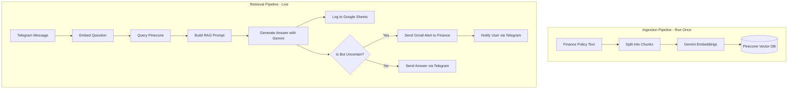

# Finance Policy RAG Agent

A 24/7 automated Telegram bot built with **n8n** that answers finance policy questions using a Retrieval-Augmented Generation (RAG) pipeline. It logs every Q&A to a compliance spreadsheet and automatically escalates unknown queries via email to the finance team.

## Features

- **24/7 Availability:** Instant answers to employee finance and policy questions via Telegram.
- **RAG Architecture:** Uses Google Gemini for generating embeddings and answers, ensuring responses are based _strictly_ on your provided company policies.
- **Vector Search:** Leverages Pinecone vector database for fast and accurate semantic retrieval of policy chunks.
- **Compliance Logging:** Automatically logs every question, answer, timestamp, and user into a Google Sheet for audit trails.
- **Human-in-the-Loop Escalation:** Detects when the bot is uncertain and automatically escalates the query to the finance department via Gmail.

## Tech Stack

- **[n8n](https://n8n.io/):** Workflow automation and orchestration
- **Google Gemini (2.5 Flash & gemini-embedding-2):** LLM for embeddings and text generation
- **Pinecone:** Serverless vector database
- **Telegram API:** Chat interface for users
- **Google Sheets API:** Audit and compliance logging
- **Gmail API:** Escalation alerts

## Architecture

## Showcase

## Setup Instructions

*For a full, comprehensive walkthrough, please see the [**SETUP-GUIDE.md**](SETUP-GUIDE.md).*

### 1. Prerequisites
You will need API keys for the following services:
- **Google Gemini**: Get a free API key from [Google AI Studio](https://aistudio.google.com/).
- **Pinecone**: Create a free account at [Pinecone](https://www.pinecone.io/) and create an index with dimension `768` and metric `cosine`.
- **Telegram**: Use BotFather on Telegram to create a bot and get an HTTP API token.

### 2. Import into n8n
1. Open your n8n instance.
2. Go to **Workflows** -> **Add Workflow** -> click the **...** (three dots) -> **Import from File**.
3. Import `ingestion_workflow.json` first.
4. Import `Finance RAG — Retrieval Agent.json` second.

### 3. Add Credentials & Keys
- Inside the n8n UI, update the HTTP Request nodes by entering your **Pinecone API Key**, **Pinecone Host URL**, and **Gemini API Key**.
- Create n8n credentials for **Telegram**, **Google Sheets**, and **Gmail** when prompted by the respective nodes.

### 4. Run the Pipeline
1. Open the **Ingestion Workflow** and click **Test Workflow** (or **Execute**) to chunk and upload the finance policy text to your Pinecone vector database. You only need to do this once!
2. Open the **Retrieval Agent Workflow**, make sure your Telegram bot is linked, and click **Test Workflow**.
3. Send a message to your bot on Telegram (e.g., "How many days do I have to process a reimbursement?").
4. Watch the magic happen!

## Repository Contents

- `ingestion_workflow.json` - The n8n workflow that chunks your policy text, generates embeddings, and stores them in Pinecone.
- `Finance RAG — Retrieval Agent.json` - The live n8n workflow that listens to Telegram, queries the vector database, generates answers, logs to Google Sheets, and handles escalations.
- `assets/` - Project screenshots.
- `SETUP-GUIDE.md` - Comprehensive instructions for configuring and running the agent.
- `.gitignore` - Standard exclusions for n8n projects.

## License

This project is licensed under the MIT License - see the [LICENSE](LICENSE) file for details.
