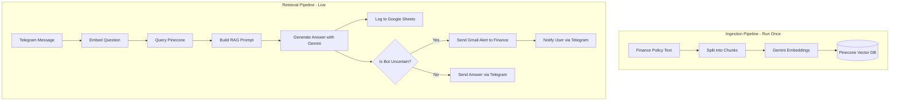

# Finance Policy RAG Agent

A 24/7 automated Telegram bot built with **n8n** that answers finance policy questions using a Retrieval-Augmented Generation (RAG) pipeline. It logs every Q&A to a compliance spreadsheet and automatically escalates unknown queries via email to the finance team.

## Features

- **24/7 Availability:** Instant answers to employee finance and policy questions via Telegram.
- **RAG Architecture:** Uses Google Gemini for generating embeddings and answers, ensuring responses are based _strictly_ on your provided company policies.
- **Vector Search:** Leverages Pinecone vector database for fast and accurate semantic retrieval of policy chunks.
- **Compliance Logging:** Automatically logs every question, answer, timestamp, and user into a Google Sheet for audit trails.
- **Human-in-the-Loop Escalation:** Detects when the bot is uncertain and automatically escalates the query to the finance department via Gmail.

## Tech Stack

- **[n8n](https://n8n.io/):** Workflow automation and orchestration
- **Google Gemini (2.5 Flash & gemini-embedding-2):** LLM for embeddings and text generation
- **Pinecone:** Serverless vector database
- **Telegram API:** Chat interface for users
- **Google Sheets API:** Audit and compliance logging
- **Gmail API:** Escalation alerts

## Architecture

## Setup Instructions

This repository contains exported n8n workflow JSON files that you can import directly into your own n8n instance.

Please follow the detailed, step-by-step instructions in the [**SETUP_GUIDE.md**](SETUP_GUIDE.md) file to get your environment configured. The setup guide covers:

- Generating all necessary API keys and credentials
- Importing the workflows into n8n
- Running the ingestion pipeline
- Testing the live retrieval agent

## Repository Contents

- `ingestion_workflow.json` - The n8n workflow that chunks your policy text, generates embeddings, and stores them in Pinecone.
- `Finance RAG — Retrieval Agent.json` - The live n8n workflow that listens to Telegram, queries the vector database, generates answers, logs to Google Sheets, and handles escalations.
- `SETUP_GUIDE.md` - Comprehensive instructions for configuring and running the agent.
- `.gitignore` - Standard exclusions for n8n projects.

## License

This project is licensed under the MIT License - see the [LICENSE](LICENSE) file for details.
